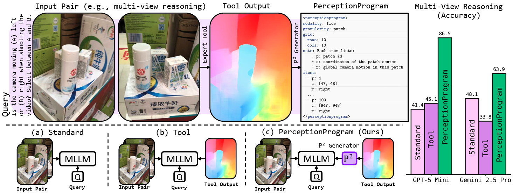

<div align="center">
  <h1>
    <a href="https://arxiv.org/pdf/2604.12896">
      Unlocking Visual Tool Reasoning in Language Models via Perception Programs ✨ [CVPR 2026] ✨
    </a>
  </h1>
  <p>
    
  </p>
</div>

---

## Core idea

`generate_perception_program.py` takes the output of a CV tool (depth
estimation, optical flow, keypoint correspondence, object detection,
segmentation, jigsaw-edge similarity, semantic correspondence) and converts
it into a terse `<perceptionprogram>...</perceptionprogram>` text block:
a list of `items` (id, coordinates, value, optional label) plus derived
`relations` (e.g. `[p=3, in_front_of, p=7]`). This is what gets fed to the
model instead of pixels or a verbose tool dump.

Every LLM is evaluated in three modes:
- **Standard** — image only, no tool output
- **Tool** — raw tool output as text
- **PP** — the perception program

## Files

- `generate_perception_program.py` — the PP generator described above.
- `run_gpt.py` — GPT-5 on BLINK's Multi-View Reasoning task (all 3 modes).
- `run_gemini.py` — Gemini 2.5 Pro on BLINK's Semantic Correspondence task.
- `run_qwen4b.py` — Qwen3VL-4B on BLINK's Object Localization task (PP mode).
- `internvl/` — full eval harness for InternVL 2B/4B across all BLINK tasks
  and all three modes. Entry point: `internvl/icl_internvl3_blink.py`.
  See `internvl/README.md` for CLI usage. Key subfolders:
  - `eval_config/` — per-task, per-mode config (paths, templates)
  - `prompts/` — system prompts + ICL examples, per task
  - `pp_tools/` — PP generation + BLINK scoring utilities
  - `ml_utils/` — batch inference helpers

## Benchmark

All tasks are from BLINK: multi-view reasoning, visual correspondence,
relative depth, jigsaw, semantic correspondence, object localization.

## Beyond BLINK

PerceptionProgram can be similarly extended to other tasks by adding the task specification (what each value in the P^2 would correspond to) to `generate_perception_program.py` and calling the function wherever a tool call is required, similar to how it is done for `gpt`, `gemini`, `qwen3vl` or `internvl` models.

## Citation

If you find the work useful, please consider citing: 

```
@InProceedings{Janjua_2026_CVPR,
    author    = {Janjua, Muhammad Kamran and Silva, Hugo and Niu, Di and Rashidi, Bahador},
    title     = {Don't Show Pixels, Show Cues: Unlocking Visual Tool Reasoning in Language Models via Perception Programs},
    booktitle = {Proceedings of the IEEE/CVF Conference on Computer Vision and Pattern Recognition (CVPR)},
    month     = {June},
    year      = {2026},
    pages     = {5165-5174}
}
```
